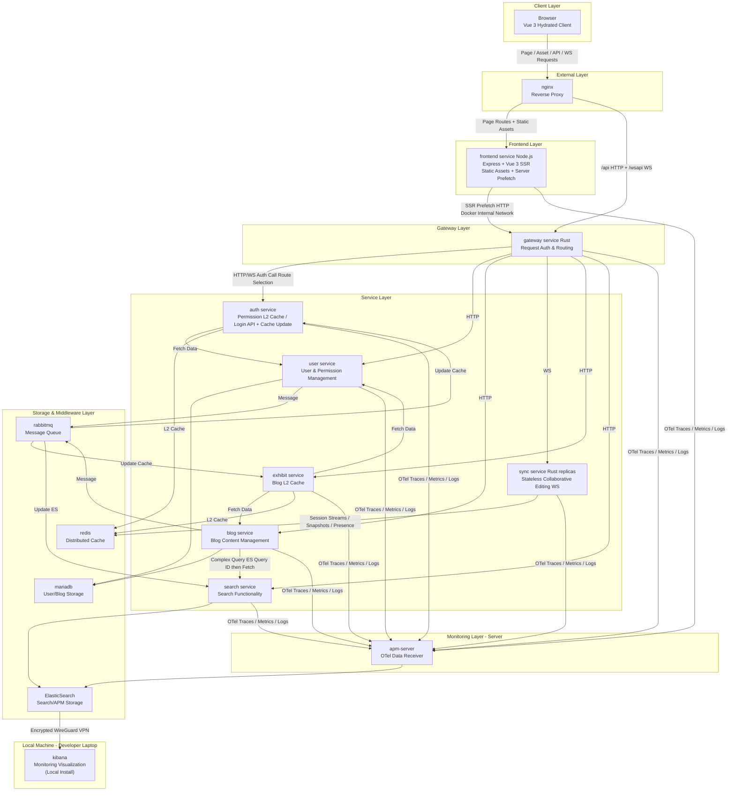

# Megalith Micro

[](https://openjdk.java.net/)
[](https://www.rust-lang.org/)
[](https://nodejs.org/)
[](https://opensource.org/licenses/Apache-2.0)

A Java, Rust, and Node.js microservices platform providing multi-level caching, distributed tracing, server-side rendering, and real-time collaboration capabilities.

## 🏗️ Architecture



## 📦 Modules

### Java Modules (Spring Boot)

| Module | Description |
|--------|-------------|
| `cache` | Megalith Cache Spring Boot Starter - Multi-level caching (L1 Caffeine + L2 Redis) with distributed eviction |
| `common` | Shared utilities, DTOs, and converters |
| `micro-auth` | Authentication service - JWT, Email/SMS authentication |
| `micro-blog` | Blog content management with sensitive content handling |
| `micro-user` | User management with Hibernate ORM |
| `micro-exhibit` | Blog display and visit statistics |
| `micro-search` | Full-text search powered by Elasticsearch |

### Rust Modules

| Module | Description |
|--------|-------------|
| `micro-gateway-rs` | High-performance API gateway built with Axum, JWT auth, OpenTelemetry tracing |
| `micro-sync-rs` | Real-time collaboration sync service using WebSocket and YRS CRDT |

## ✨ Features

- **Multi-Level Caching**: L1 (Caffeine) + L2 (Redis) with automatic eviction via RabbitMQ or Redis pub/sub
- **Distributed Tracing**: Full OpenTelemetry integration across all services
- **GraalVM Native Support**: All Java microservices support native compilation
- **Real-time Collaboration**: CRDT-based sync via WebSocket (YRS)
- **Stateless Sync Replicas**: Collaboration sessions are relayed and compacted through shared Redis; load balancers do not need sticky sessions
- **JWT Authentication**: Secure token-based auth across services
- **JPMS Module**: Proper Java Platform Module System support

## 🛠️ Tech Stack

**Java:**
- Spring Boot 4.1.0
- Hibernate ORM 7.4.1
- Redisson 4.5.0 (Redis)
- Caffeine Cache
- Elasticsearch

**Rust:**
- Axum 0.8 (Web framework)
- Tokio (Async runtime)
- YRS (CRDT)
- OpenTelemetry

**Node.js:**
- Express 5 + Vue 3 SSR
- OpenTelemetry traces, metrics, and logs

**Infrastructure:**
- Nginx (External Gateway + Frontend Proxy)
- MariaDB (User/Blog Storage)
- Redis (Distributed Cache)
- RabbitMQ (Message Queue)
- ElasticSearch (Search + APM Storage)
- APM-Server (OTel Data Receiver)
- Kibana (Monitoring Visualization)

## 🚀 Quick Start

### Prerequisites

- JDK 25
- Rust 2024 edition
- Redis
- RabbitMQ (optional, for distributed cache eviction)

### Build

```bash
# Build all Java modules
./gradlew build

# Build Rust modules
cargo build --manifest-path micro-gateway-rs/Cargo.toml
cargo build --manifest-path micro-sync-rs/Cargo.toml
```

### Run

```bash
# Run Java microservices
./gradlew :micro-auth:bootRun
./gradlew :micro-blog:bootRun

# Run Rust services
cargo run --manifest-path micro-gateway-rs/Cargo.toml
cargo run --manifest-path micro-sync-rs/Cargo.toml
```

`micro-sync-rs` requires Redis 6.2 or newer. Every replica must use the same
single-node Redis endpoint through `REDIS_URL`; Redis Cluster is intentionally
not supported. Redis stores the transient collaboration draft for five minutes
after the final connection lease expires. Explicit saves continue to use the
blog service and MariaDB as the source of truth.

Nested sync settings use a double underscore in environment variables, for
example `SYNC__SESSION_RETENTION_SECONDS=300` and `WORKER__CONCURRENCY=4`.

## 📁 Project Structure

```
megalith-micro/
├── cache/                    # Cache Spring Boot Starter
├── common/                   # Shared utilities
├── micro-auth/               # Authentication service
├── micro-blog/               # Blog service
├── micro-exhibit/            # Blog display service
├── micro-search/             # Search service
├── micro-user/               # User service
├── micro-gateway-rs/         # Rust API Gateway
└── micro-sync-rs/            # Rust Sync Service
```

## 📄 License

This project is licensed under the Apache License 2.0 - see the [LICENSE](LICENSE) file for details.
