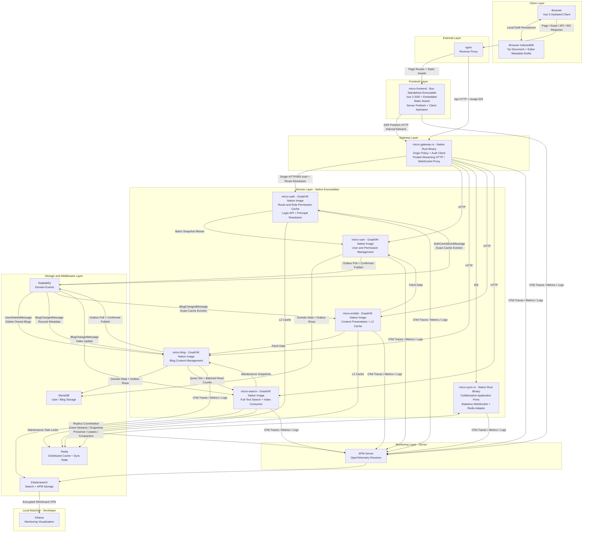
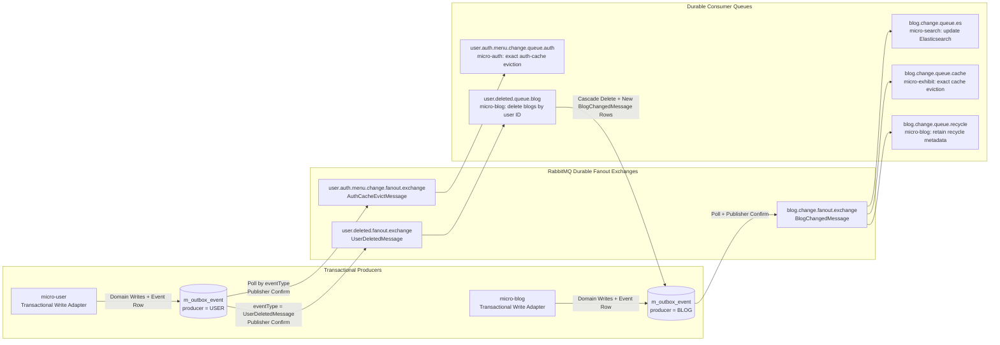

# Megalith Micro

[](https://www.graalvm.org/)
[](https://spring.io/projects/spring-boot)
[](https://www.rust-lang.org/)
[](https://bun.sh/)
[](LICENSE)

> **Inspired by Zhiming Zhou's _The Phoenix Architecture_ (《凤凰架构》), this project is a
> hands-on exploration of the ideas presented in the book. Its lifecycle has followed the broader
> evolution of software architecture, from a monolith through distributed systems and
> microservices, and it is now in its cloud-native stage.**

Megalith Micro is a platform monorepo designed to ship every application as a **single native
executable**.

**The Java services are not deployed as JVM applications or JARs.** All five Spring Boot services
use Java 25 and GraalVM Native Image for ahead-of-time compilation, so their production images do
not require a JVM or JRE. The gateway and collaboration service compile to native Rust binaries;
the frontend service is compiled to a standalone executable by Bun.

The entire platform therefore follows the same model: **one application, one native executable,
one independent OCI image**. Application images contain the executable and only the minimal
runtime files, with no source code, build toolchain, or separate language runtime.

| Applications | Technology | Production artifact |
| --- | --- | --- |
| `micro-auth`, `micro-user`, `micro-blog`, `micro-exhibit`, `micro-search` | Java 25, Spring Boot 4.1.1, GraalVM | GraalVM Native Image executable |
| `micro-gateway-rs`, `micro-sync-rs` | Rust 2024, Tokio, Axum | Rust release executable |
| `micro-frontend` | Bun 1.4.0, Vue 3.5, Vite 8, SSR | Bun standalone executable with embedded assets |

> MariaDB, Redis, RabbitMQ, Elasticsearch, and other infrastructure components continue to use
> their standard images. "Single binary" describes how the platform applications are built and
> delivered.

## Architecture



All external traffic enters through nginx. The Rust gateway proxies HTTP and WebSocket requests,
calls `micro-auth` once for authorization and route resolution, and passes a trusted principal to
the target service. Business services never re-parse browser credentials.

### Message and outbox topology



| Event | Producer | Exchange | Queue and consumer | Effect |
| --- | --- | --- | --- | --- |
| `AuthCacheEvictMessage` | `micro-user` | `user.auth.menu.change.fanout.exchange` | `user.auth.menu.change.queue.auth` -> `micro-auth` | Evict exact authorization, menu, and route cache entries |
| `UserDeletedMessage` | `micro-user` | `user.deleted.fanout.exchange` | `user.deleted.queue.blog` -> `micro-blog` | Delete blogs owned by deleted users and enqueue their blog-change events |
| `BlogChangedMessage` | `micro-blog` | `blog.change.fanout.exchange` | `blog.change.queue.es` -> `micro-search` | Apply revision-aware Elasticsearch index changes |
| `BlogChangedMessage` | `micro-blog` | `blog.change.fanout.exchange` | `blog.change.queue.cache` -> `micro-exhibit` | Invalidate exact presentation cache entries |
| `BlogChangedMessage` | `micro-blog` | `blog.change.fanout.exchange` | `blog.change.queue.recycle` -> `micro-blog` | Store recycle-bin metadata for an operator-initiated removal |

Search content events compare the persisted blog `event_revision` with the document's
`_source.revision` atomically. Elasticsearch's own `_version` is independent and is never used as
the blog revision. Reading an article updates MariaDB's cumulative counter and the Redis hot list;
`micro-blog` synchronizes cumulative counts to Elasticsearch every 60 seconds in batches of 500.
Statistics updates are idempotent, preserve newer counts, and cannot recreate deleted documents.

Administration lists, filters, counts, and exports always select IDs through Elasticsearch,
including requests without keywords. MariaDB supplies current content and sensitive ranges for
those IDs, with a second permission/filter check and the Elasticsearch ordering preserved.
Search failures remain visible; there is no independent database search fallback.

All presentation pages remain eligible for two-level caching. The `blog-page:v3` contract uses
`@Cache(trackKeys = true)` to register generated keys before loading or promoting a value. Blog
events invalidate those exact registered page keys in batches, so blog writes no longer calculate
pagination counts for cache consumers. Existing queued events with those legacy fields are accepted.

For the coordinated upgrade, index alias migration, maintenance rebuild, failure recovery, and
configuration, see [Search and cache operations](docs/search-and-cache-operations.md).

The producer-side outbox and consumer-side retry paths solve different failures. An outbox row is
deleted only after RabbitMQ confirms the persistent message; publish failures remain in MariaDB and
are rescheduled with bounded backoff and jitter. Consumers acknowledge manually. A handler failure
is republished with publisher confirmation to that queue's retry exchange, delayed for 5 seconds,
30 seconds, and 300 seconds, and finally moved to `<queue>.dlq`, which retains it for 14 days.
Aggregate types such as `USER_DELETION` classify outbox rows, while the payload class name stored as
the event type selects a dedicated exchange, such as `UserDeletedMessage` selecting
`user.deleted.fanout.exchange`.

`micro-sync-rs` replicas coordinate through Redis. Document and awareness updates are appended to
shared Redis Streams and relayed to connections on every replica, while snapshots, presence
ownership, connection leases, and compaction work remain in shared Redis state. Any replica can
therefore accept a connection for any room without sticky sessions or assigning that room to a
single process. The Redis store keeps its presence and compaction implementations in focused
submodules, and loads multi-step atomic Redis operations from standalone `.lua` source files.

## Applications and Modules

### Deployable Applications

| Application | Responsibility |
| --- | --- |
| `micro-gateway-rs` | Streaming HTTP/WebSocket proxy, origin checks, centralized authorization entry point, and dynamic routing |
| `micro-auth` | JWT, login, route authorization, and authorization snapshot caches |
| `micro-user` | Users, roles, menus, authorities, and data permissions |
| `micro-blog` | Blog content, recycle bin, domain events, and user-deletion cleanup |
| `micro-exhibit` | Content presentation, visit statistics, and presentation caches |
| `micro-search` | Elasticsearch full-text search and index event consumption |
| `micro-sync-rs` | Stateless real-time collaboration backed by YRS CRDT and Redis |
| `micro-frontend` | Vue 3 SSR, server prefetch, client hydration, and embedded static assets |

### Shared Java Modules

| Module | Responsibility |
| --- | --- |
| `api-auth`, `api-user`, `api-blog`, `api-search` | Typed HTTP contracts and RPC records |
| `cache` | Caffeine L1 + Redis L2 caching, exact eviction, and replica-wide invalidation |
| `common-contract` | Result, error, paging, validation, security, and message contracts |
| `common-rpc` | HTTP clients, principal propagation, and external service adapters |
| `common-web`, `common-auth-web` | Functional WebMVC, error handling, validation, and trusted principal resolution |
| `common-observability` | OpenTelemetry integration and GraalVM runtime hints |
| `common-messaging`, `common-outbox` | Consumer retries, dead-letter queues, and the transactional outbox |
| `common-scheduling`, `common-export` | Distributed scheduler locks and export utilities |

### Java application boundaries

The five Java applications use the same ports-and-adapters layout for their core code:

| Package | Responsibility |
| --- | --- |
| `domain` | Business entities and domain state without delivery or infrastructure dependencies |
| `application.model` | Use-case-specific inputs, outputs, and event context |
| `application.port.in` | Use cases exposed to HTTP, messaging, and schedulers |
| `application.port.out` | Persistence, remote service, Redis, search, and object-storage capabilities required by use cases |
| `application.service` | Use-case orchestration; depends on domain types and ports rather than adapters |
| `adapter.in.*` | Functional WebMVC handlers/routes and RabbitMQ consumers |
| `adapter.out.*` | HTTP clients, Spring Data repositories, transactional writers, Redis, Elasticsearch, and object storage |
| `config` | Spring wiring, RabbitMQ topology, AOT hints, and application configuration |

Input adapters call input ports, and application services call output ports. Spring Data,
Redisson, remote HTTP contracts, and storage clients stay behind output adapters. Some
transactional persistence adapters retain historical `*Wrapper` class names, but services depend
on their writer ports rather than those concrete classes. ArchUnit checks these boundaries and
also keeps transaction ownership out of application services.

### Rust application boundaries

The Rust services use boundaries suited to their responsibilities rather than sharing a directory
template mechanically:

| Service area | Responsibility |
| --- | --- |
| `micro-sync-rs/domain` | Yjs protocol handling and collaboration event/state models |
| `micro-sync-rs/application` | Room, relay, lease, presence, and compaction orchestration through store ports |
| `micro-sync-rs/adapter/inbound` | Axum WebSocket and health delivery |
| `micro-sync-rs/adapter/outbound/redis` | Redis Streams, snapshots, presence, workers, connections, and external Lua scripts |
| `micro-gateway-rs/client` | Pooled downstream HTTP and the bounded auth control-plane client |
| `micro-gateway-rs/proxy` | Authorized-route models and no-I/O origin, header, URI, and WebSocket-frame policies |
| `micro-gateway-rs/handler`, `middleware` | Axum HTTP/WebSocket delivery and single-pass authorization flow |

`micro-sync-rs` application code depends on store traits and application-level errors; Redis
connections, result types, keys, and Stream ID strings remain inside the outbound adapter. The
gateway is itself an edge adapter, so it keeps transport-oriented modules instead of introducing an
artificial domain and application hierarchy.

## Frontend

`micro-frontend` is the Bun workspace for the production `megalith-frontend` service. JavaScript
dependency versions are defined once in the root `package.json` catalog, while the workspace
declares the packages it uses through the `catalog:` protocol. The service remains independently
built and deployed outside the Gradle and Cargo workspaces.

Public and administration routes are rendered on the Bun server and hydrated by Vue in the
browser. Each SSR request creates isolated Vue Router, Pinia, i18n, head-management, and HTTP
state; route data prefetched through `micro-gateway-rs` is serialized into the page and reused
during hydration. Subsequent browser API and WebSocket traffic goes directly through nginx to the
gateway instead of passing through the frontend server.

Authentication tokens are transported only in HttpOnly cookies. The SSR server forwards request
cookies to the gateway and propagates refreshed `Set-Cookie` headers, while browser code never
reads or persists access or refresh tokens.

### Editor collaboration and drafts

The administration editor uses Yjs for real-time collaboration. In the browser, `y-indexeddb`
persists the Yjs document locally, while editor metadata such as the title, description, status,
cover, and sensitive-word selections is stored separately in IndexedDB. Persistence keys include
the authenticated user ID and blog ID, so drafts are isolated between users and editing sessions.

When an editor room opens, the local Yjs document is restored before the WebSocket connection is
started. The same Yjs document then synchronizes with `micro-sync-rs`; local and remote updates are
merged by Yjs, and a persisted local document is never treated as an authoritative replacement for
the remote document. For a new document, the initial server content is inserted only when the
synced Yjs document has no existing state.

IndexedDB and WebSocket collaboration are browser-only and do not participate in SSR. If IndexedDB
is unavailable, the editor falls back to online collaboration without local persistence. When a
backgrounded tab becomes visible again, the editor refreshes its short-lived collaboration ticket
before reconnecting. If the login session has expired, editing is paused, the local draft is kept,
and the user is prompted to log in again and returned to the original edit route. A successful save
clears both the Yjs document draft and the metadata draft.

Vite builds the client and SSR bundles, then Bun compiles the server, runtime, and assets into
`micro-frontend/dist/bin/megalith-frontend`. The runtime image contains only that executable and
minimal OS runtime files. It exposes `/actuator/health`, performs graceful shutdown, and exports
correlated OpenTelemetry traces, metrics, and logs.

| Variable | Default / production value | Purpose |
| --- | --- | --- |
| `PORT` | `1919` | Bun SSR listen port |
| `SSR_API_BASE_URL` | `http://127.0.0.1:8088` / `http://micro-gateway-rs:8088` | Gateway used for SSR prefetch |
| `APP_ORIGIN` | Incoming request origin | Origin forwarded for cookie-authenticated requests |
| `OTEL_SERVICE_VERSION` | Package version / deployed Git SHA | Frontend release identifier |
| `OTEL_EXPORTER_OTLP_ENDPOINT` | `http://127.0.0.1:8200` / `http://apm-server:8200` | Base OTLP endpoint for traces, metrics, and logs |
| `LOG_LEVEL` | `info` | Console and OTLP application log threshold |

See the [SSR architecture](micro-frontend/docs/ssr-architecture.md) for request flow,
authentication, caching, observability, failure behavior, and deployment details.

## Core Design

- **Single-pass authorization:** the gateway calls `POST /inner/auth/route` once to resolve both
  the target service and trusted principal. Business services trust only the
  `X-Megalith-Principal` injected by the gateway.
- **Two-level caching:** `@Cache` uses explicit versioned namespaces and canonical argument hashes,
  then reads through Caffeine L1 followed by Redis L2. Exact eviction waits on the same distributed
  locks and broadcasts to every replica to clear local entries.
- **Short write transactions:** services perform reads, validation, and input preparation outside
  a transaction. Transactional persistence adapters perform only writes and the matching outbox
  insert inside one short transaction. ArchUnit enforces this boundary.
- **Reliable domain events:** user and blog changes commit to a MariaDB transactional outbox before
  confirmed publication through RabbitMQ. Cache eviction and Elasticsearch indexing consume these
  durable events.
- **User-deletion cleanup:** deleting users writes a `UserDeletedMessage` to the user outbox and
  routes it through a dedicated fanout exchange. `micro-blog` consumes the event and deletes blogs
  owned by those users; cascade deletions do not create recycle-bin entries for a missing operator.
- **Stateless collaboration:** `micro-sync-rs` uses YRS CRDT and shared Redis for session streams,
  snapshots, and presence. Replicas do not require sticky sessions.
- **External Lua sources:** Redis Lua is stored only in `.lua` files. Java adapters read classpath
  resources registered for Native Image, while Rust uses `include_str!` so the release binary does
  not require the source tree at runtime. Lua bodies are never embedded in Java or Rust strings.
- **Native observability:** Java Native Image, Rust, and Bun applications export OpenTelemetry
  traces, metrics, and logs.
- **Centralized workspace versions:** the root Bun catalog owns JavaScript dependency versions;
  each frontend declares only the packages it uses through the `catalog:` protocol.

## Build

### Requirements

- GraalVM for JDK 25 using the HotSpot JVM, not the Espresso JVM
- Gradle 9.7 through the included Wrapper
- Rust stable with 2024 edition support
- Bun 1.4.0
- Docker for OCI image builds

Example on macOS:

```bash
export JAVA_HOME=/Library/Java/JavaVirtualMachines/graalvm-25.3.4.1+1.1/Contents/Home
```

### Checks and Tests

```bash
./gradlew build
./gradlew :micro-blog:integrationTest :micro-search:integrationTest :cache:integrationTest
cargo fmt --all -- --check
cargo clippy --workspace --all-targets -- -D warnings
cargo test --workspace
# Requires a Redis 8 instance on localhost.
MICRO_SYNC_TEST_REDIS_URL=redis://127.0.0.1:6379/ \
  cargo test -p micro-sync-rs redis_store_round_trip_when_configured -- --ignored
bun install --frozen-lockfile
bun run frontend:check
```

The Java build includes unit tests, ArchUnit, and Spring AOT test processing.

### Native Executables

```bash
# Java / GraalVM Native Image
./gradlew :micro-auth:nativeCompile

# Rust
cargo build --workspace --release

# Bun workspace / frontend
bun run frontend:build
```

Java artifacts are written to each module's `build/native/nativeCompile/` directory. Rust artifacts
are written to `target/release/`; the frontend executable is written to
`micro-frontend/dist/bin/megalith-frontend`.

### Application Images

Spring Boot Buildpacks compile and publish each Java service as a GraalVM Native Image. Set
`DOCKER_USERNAME` and `DOCKER_PWD` before running the task:

```bash
./gradlew :micro-auth:bootBuildImage
```

The Rust and Bun services use multi-stage Dockerfiles. Their final images contain only the release
executable and required runtime files:

```bash
docker build -t megalith-micro-gateway-rs:latest -f micro-gateway-rs/Dockerfile .
docker build -t megalith-micro-sync-rs:latest -f micro-sync-rs/Dockerfile .
docker build -t mingchiuli/megalith-frontend:latest -f micro-frontend/Dockerfile .
```

CI validates AOT processing and builds a separate GraalVM Native Image for each of the five Java
services. It formats, lints, and tests the two Rust services, runs the ignored collaboration store
integration test against Redis 8, and checks the Bun frontend before building release images.
Changed services are published independently and deployed in platform order, with the frontend
after the gateway.

### Development

Native compilation can be skipped when running a single service during development:

```bash
./gradlew :micro-auth:bootRun
cargo run -p micro-gateway-rs
bun run frontend:dev
```

The frontend development server listens on `http://127.0.0.1:1919` and expects the gateway at
`http://127.0.0.1:8088`. For local HTTP login, run `micro-auth` with
`MEGALITH_AUTH_COOKIE_SECURE=false`.

A complete local deployment also requires MariaDB, Redis, RabbitMQ, and Elasticsearch. Connection,
port, and OpenTelemetry settings are defined in each module's `application.yml`.

## License

This project is licensed under the [Apache License 2.0](LICENSE).
