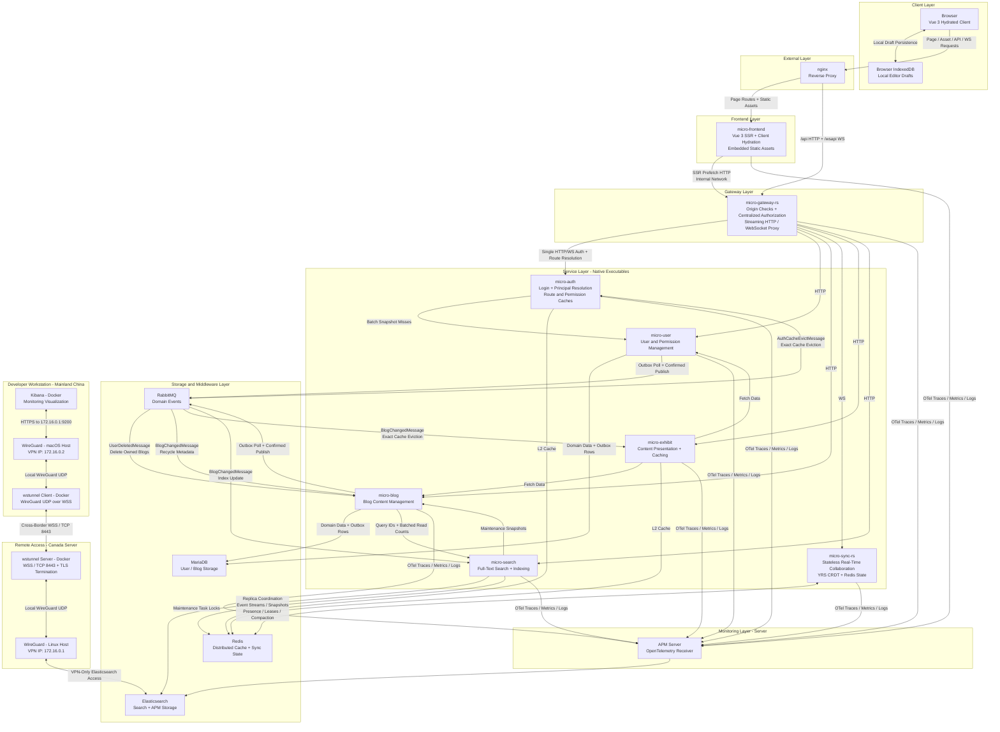
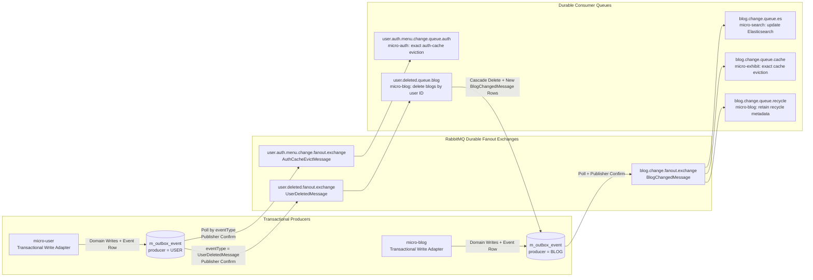

# Megalith Micro

[](https://www.graalvm.org/)
[](https://spring.io/projects/spring-boot)
[](https://www.rust-lang.org/)
[](https://bun.sh/)
[](LICENSE)

Megalith Micro is a cloud-native blogging and content-management platform with public publishing,
administration, full-text search, and collaborative editing. This monorepo brings together Java
business services, a Rust gateway and collaboration service, and a Vue SSR frontend.

> Inspired by Zhiming Zhou's _The Phoenix Architecture_ (《凤凰架构》), the project explores
> software architecture through a working application, evolving from a monolith through
> distributed systems and microservices to a cloud-native deployment.

Every application is delivered as a **single native executable in its own OCI image**. The five
Spring Boot services compile ahead of time with GraalVM Native Image, the Rust services build as
release binaries, and Bun packages the frontend server and assets into a standalone executable.
Production application images contain the executable and minimal OS runtime files, without a
separate JVM, JRE, Bun installation, build toolchain, or source tree.

| Applications | Technology | Production artifact |
| --- | --- | --- |
| `micro-auth`, `micro-user`, `micro-blog`, `micro-exhibit`, `micro-search` | Java 25, Spring Boot 4.1.1, GraalVM | GraalVM Native Image executable |
| `micro-gateway-rs`, `micro-sync-rs` | Rust 2024, Tokio, Axum | Rust release executable |
| `micro-frontend` | Bun 1.4.2, Vue 3.5, Vite 8, SSR | Bun standalone executable with embedded assets |

MariaDB, Redis, RabbitMQ, Elasticsearch, and the monitoring infrastructure use their standard
container images.

## Architecture



Public application traffic enters through nginx. The Rust gateway proxies HTTP and WebSocket requests,
calls `micro-auth` once for authorization and route resolution, and passes a trusted principal to
the target service. Business services use that principal for identity and permission checks.

### Remote administration: WireGuard over WSS

The platform uses a private network for remote monitoring and administration. Kibana runs in
Docker on a developer workstation in mainland China and connects to Elasticsearch on the Canadian
server through WireGuard. Elasticsearch is accessible over the VPN without exposing its API to
the public Internet.

The project uses [wstunnel](https://github.com/erebe/wstunnel/blob/v10.7.1/README.md#wireguard) to
address Great Firewall (GFW) interference with cross-border WireGuard UDP connectivity. A
Dockerized client and server carry WireGuard's encrypted UDP packets over a TLS-protected
WebSocket connection (WSS), allowing the public connection to use TCP. WireGuard provides VPN
addressing, peer authentication, and end-to-end encryption; wstunnel provides the transport across
the filtered network. TCP retransmissions can add latency when packets are lost.

The WSS connection terminates at a dedicated wstunnel listener on TCP `8443`, independently of nginx
and the application gateway. The client verifies the server's TLS certificate, and the server
requires a shared access token and restricts forwarding to its local WireGuard listener. Only the
private subnet is routed through the VPN, where Kibana reaches Elasticsearch at
`https://172.16.0.1:9200`.

### Message and outbox topology

User and blog changes propagate through a transactional outbox and RabbitMQ. Each event has
dedicated consumers for authorization caches, search indexing, presentation caches, or related
content cleanup.



| Event | Producer | Consumer | Responsibility |
| --- | --- | --- | --- |
| `AuthCacheEvictMessage` | `micro-user` | `micro-auth` | Invalidate authorization, menu, and route caches |
| `UserDeletedMessage` | `micro-user` | `micro-blog` | Delete the user's blogs and emit the corresponding blog events |
| `BlogChangedMessage` | `micro-blog` | `micro-search` | Update the search index |
| `BlogChangedMessage` | `micro-blog` | `micro-exhibit` | Invalidate presentation caches |
| `BlogChangedMessage` | `micro-blog` | `micro-blog` | Retain recycle-bin metadata for operator removals |

Domain writes and outbox entries commit in the same database transaction. The publisher removes
an outbox entry after RabbitMQ confirms publication and retries failed publications with bounded
backoff. Consumers use manual acknowledgements and confirmed retry publication; messages that
exhaust their delayed retries are retained in dead-letter queues for investigation and recovery.

### Search and caching

Elasticsearch provides full-text search and selects blog IDs for administration lists, filters,
counts, and exports. MariaDB supplies current content for those IDs, with permissions and filters
checked again before returning results in search order. Content events carry revisions so index
consumers can reject stale updates. Article visits update MariaDB counters and the Redis hot list;
cumulative counts are synchronized to Elasticsearch in batches through idempotent updates.

Presentation reads use Caffeine as an in-process L1 cache and Redis as a shared L2 cache. Versioned
cache keys identify individual results, and a key registry tracks cached pages for invalidation.
Blog events invalidate the affected entries across service replicas. See the
[cache module](cache/README.md) for key generation, locking, and distributed eviction.

### Stateless collaboration

`micro-sync-rs` uses YRS CRDT for collaborative documents and Redis for coordination across
replicas. Document and awareness updates flow through shared Redis Streams to connected clients.
Snapshots, presence, connection leases, and compaction state also live in Redis, allowing any
replica to serve any room without sticky sessions or a dedicated room owner.

## Applications and Modules

### Deployable Applications

| Application | Responsibility |
| --- | --- |
| `micro-gateway-rs` | Streaming HTTP/WebSocket proxy, origin checks, centralized authorization entry point, and dynamic routing |
| `micro-auth` | JWT, login, route authorization, and authorization snapshot caches |
| `micro-user` | Users, roles, menus, authorities, and data permissions |
| `micro-blog` | Blog content, recycle bin, domain events, and user-deletion cleanup |
| `micro-exhibit` | Content presentation, visit statistics, and presentation caches |
| `micro-search` | Elasticsearch full-text search and index event consumption |
| `micro-sync-rs` | Stateless real-time collaboration backed by YRS CRDT and Redis |
| `micro-frontend` | Vue 3 SSR, server prefetch, client hydration, and embedded static assets |

### Shared Java Modules

| Module | Responsibility |
| --- | --- |
| `api-auth`, `api-user`, `api-blog`, `api-search` | Typed HTTP contracts and RPC records |
| `cache` | Caffeine L1 + Redis L2 caching, exact eviction, and replica-wide invalidation |
| `common-contract` | Result, error, paging, validation, security, and message contracts |
| `common-rpc` | HTTP clients, principal propagation, and external service adapters |
| `common-web`, `common-auth-web` | Functional WebMVC, error handling, validation, and trusted principal resolution |
| `common-observability` | OpenTelemetry integration and GraalVM runtime hints |
| `common-messaging`, `common-outbox` | Consumer retries, dead-letter queues, and the transactional outbox |
| `common-scheduling`, `common-export` | Distributed scheduler locks and export utilities |

### Java application boundaries

The five Java applications use the same ports-and-adapters layout for their core code:

| Package | Responsibility |
| --- | --- |
| `domain` | Business entities and domain state without delivery or infrastructure dependencies |
| `application.model` | Use-case-specific inputs, outputs, and event context |
| `application.port.in` | Use cases exposed to HTTP, messaging, and schedulers |
| `application.port.out` | Persistence, remote service, Redis, search, and object-storage capabilities required by use cases |
| `application.service` | Use-case orchestration; depends on domain types and ports rather than adapters |
| `adapter.in.*` | Functional WebMVC handlers/routes and RabbitMQ consumers |
| `adapter.out.*` | HTTP clients, Spring Data repositories, transactional writers, Redis, Elasticsearch, and object storage |
| `config` | Spring wiring, RabbitMQ topology, AOT hints, and application configuration |

Input adapters call input ports, and application services call output ports. Spring Data,
Redisson, remote HTTP contracts, and storage clients stay behind output adapters. Application
services prepare inputs and coordinate use cases; persistence adapters own the short transactions
that commit domain writes and outbox entries. ArchUnit verifies dependency and transaction
boundaries.

### Rust application boundaries

The collaboration service separates protocol, application, and infrastructure concerns. The
gateway organizes its code around authentication, forwarding policies, and HTTP/WebSocket delivery:

| Service area | Responsibility |
| --- | --- |
| `micro-sync-rs/domain` | Yjs protocol handling and collaboration event/state models |
| `micro-sync-rs/application` | Room, relay, lease, presence, and compaction orchestration through store ports |
| `micro-sync-rs/adapter/inbound` | Axum WebSocket and health delivery |
| `micro-sync-rs/adapter/outbound/redis` | Redis Streams, snapshots, presence, workers, connections, and external Lua scripts |
| `micro-gateway-rs/client` | Pooled downstream HTTP and the bounded auth control-plane client |
| `micro-gateway-rs/proxy` | Authorized-route models and no-I/O origin, header, URI, and WebSocket-frame policies |
| `micro-gateway-rs/handler`, `middleware` | Axum HTTP/WebSocket delivery and single-pass authorization flow |

`micro-sync-rs` application code depends on store traits and application-level errors; Redis
connections, keys, and Stream IDs are encapsulated by the outbound adapter. The gateway keeps
no-I/O forwarding policies separate from the clients, handlers, and middleware that perform
network operations.

## Frontend

`micro-frontend` serves the public site and administration interface using Vue 3 and Bun. It is
built and deployed independently of the Java and Rust services. The root `package.json` catalog
manages JavaScript dependency versions, referenced by workspace packages through `catalog:`.

Public and administration routes are rendered on the Bun server and hydrated by Vue in the
browser. Each SSR request creates isolated Vue Router, Pinia, i18n, head-management, and HTTP
state. The server prefetches route data through `micro-gateway-rs`, and the browser reuses it
during hydration. Browser API and WebSocket requests reach the gateway directly through nginx.

Authentication uses HttpOnly cookies. The SSR server forwards request cookies to the gateway and
propagates refreshed `Set-Cookie` headers. Access and refresh tokens stay outside browser
JavaScript and client-side storage.

### Editor collaboration and drafts

The administration editor combines Yjs real-time collaboration with local draft persistence.
Document changes synchronize with `micro-sync-rs` over WebSocket and merge through the CRDT.
IndexedDB stores document drafts and editor metadata under the authenticated user and blog IDs,
allowing work to survive page reloads while keeping users' drafts separate.

Collaboration and draft storage run in the browser. Connections use short-lived collaboration
tickets, and session expiry pauses editing while preserving the local draft for reauthentication.
The editor supports online collaboration when local storage is unavailable and clears saved
drafts after successful persistence to the server.

### Runtime and configuration

Vite builds the client and SSR bundles, then Bun compiles the server, runtime, and assets into
`micro-frontend/dist/bin/megalith-frontend`. The service exposes `/actuator/health`, performs
graceful shutdown, and exports correlated OpenTelemetry traces, metrics, and logs.

| Variable | Default / production value | Purpose |
| --- | --- | --- |
| `PORT` | `1919` | Bun SSR listen port |
| `SSR_API_BASE_URL` | `http://127.0.0.1:8088` / `http://micro-gateway-rs:8088` | Gateway used for SSR prefetch |
| `APP_ORIGIN` | Incoming request origin | Origin forwarded for cookie-authenticated requests |
| `OTEL_SERVICE_VERSION` | Package version / deployed Git SHA | Frontend release identifier |
| `OTEL_EXPORTER_OTLP_ENDPOINT` | `http://127.0.0.1:8200` / `http://apm-server:8200` | Base OTLP endpoint for traces, metrics, and logs |
| `LOG_LEVEL` | `info` | Console and OTLP application log threshold |

See the [SSR architecture](micro-frontend/docs/ssr-architecture.md) for request flow,
authentication, caching, observability, failure behavior, and deployment details.

## Core Design

- **Single-pass authorization:** the gateway calls `POST /inner/auth/route` once to resolve both
  the target service and trusted principal. Business services use the gateway-injected
  `X-Megalith-Principal` as their identity source.
- **Two-level caching:** `@Cache` uses explicit versioned namespaces and canonical argument hashes,
  with Caffeine L1 and Redis L2 storage. Reads and exact eviction share distributed key locks;
  invalidations are broadcast to every replica.
- **Short write transactions:** services perform reads, validation, and input preparation outside
  a transaction. Persistence adapters commit writes and the matching outbox entries in a short
  transaction, with ArchUnit enforcing ownership boundaries.
- **Reliable domain events:** user and blog changes commit to a MariaDB transactional outbox before
  confirmed publication through RabbitMQ. Independent consumers handle cache eviction, search
  indexing, and related content cleanup.
- **Stateless collaboration:** `micro-sync-rs` uses YRS CRDT and shared Redis for session streams,
  snapshots, and presence, allowing connections to be distributed across replicas.
- **Native resource packaging:** runtime hints cover reflective Java APIs and serialization, and
  Redis Lua resources are bundled into Java and Rust executables.
- **Correlated observability:** Java, Rust, and Bun services propagate trace context and export
  OpenTelemetry traces, metrics, and logs to the monitoring infrastructure.

## Build

### Requirements

- GraalVM for JDK 25 using the HotSpot JVM, not the Espresso JVM
- Gradle 9.7 through the included Wrapper
- Rust stable with 2024 edition support
- Bun 1.4.2
- Docker for OCI image builds

Example on macOS:

```bash
export JAVA_HOME=/Library/Java/JavaVirtualMachines/graalvm-25.3.4.1+1.1/Contents/Home
```

### Checks and Tests

```bash
./gradlew build
./gradlew :micro-blog:integrationTest :micro-search:integrationTest :cache:integrationTest
cargo fmt --all -- --check
cargo clippy --workspace --all-targets -- -D warnings
cargo test --workspace
# Requires a Redis 8 instance on localhost.
MICRO_SYNC_TEST_REDIS_URL=redis://127.0.0.1:6379/ \
  cargo test -p micro-sync-rs redis_store_round_trip_when_configured -- --ignored
bun install --frozen-lockfile
bun run frontend:check
```

Java checks cover unit tests, ArchUnit boundaries, Spring AOT processing, and integration tests.
Rust checks cover formatting, linting, and service behavior; frontend checks cover linting, types,
tests, and SSR builds.

### Native Executables

```bash
# Java / GraalVM Native Image
./gradlew :micro-auth:nativeCompile

# Rust
cargo build --workspace --release

# Bun workspace / frontend
bun run frontend:build
```

Java artifacts are written to each module's `build/native/nativeCompile/` directory. Rust artifacts
are written to `target/release/`; the frontend executable is written to
`micro-frontend/dist/bin/megalith-frontend`.

### Application Images

Spring Boot Buildpacks package each Java service as a GraalVM Native Image container. Set
`DOCKER_USERNAME` and `DOCKER_PWD` before running the task:

```bash
./gradlew :micro-auth:bootBuildImage
```

The Rust and Bun services use multi-stage Dockerfiles:

```bash
docker build -t megalith-micro-gateway-rs:latest -f micro-gateway-rs/Dockerfile .
docker build -t megalith-micro-sync-rs:latest -f micro-sync-rs/Dockerfile .
docker build -t mingchiuli/megalith-frontend:latest -f micro-frontend/Dockerfile .
```

CI runs the checks for each language, including Java AOT validation and Redis-backed collaboration
tests, before building release images. Services are published independently and deployed in
dependency order, with the frontend following the gateway.

### Development

Run individual services with their development toolchains:

```bash
./gradlew :micro-auth:bootRun
cargo run -p micro-gateway-rs
bun run frontend:dev
```

The frontend development server listens on `http://127.0.0.1:1919` and expects the gateway at
`http://127.0.0.1:8088`. For local HTTP login, run `micro-auth` with
`MEGALITH_AUTH_COOKIE_SECURE=false`.

A complete local deployment also requires MariaDB, Redis, RabbitMQ, and Elasticsearch. Backend
connection, port, and OpenTelemetry defaults are defined in each service's `application.yml`;
frontend settings are listed above.

## License

This project is licensed under the [Apache License 2.0](LICENSE).
