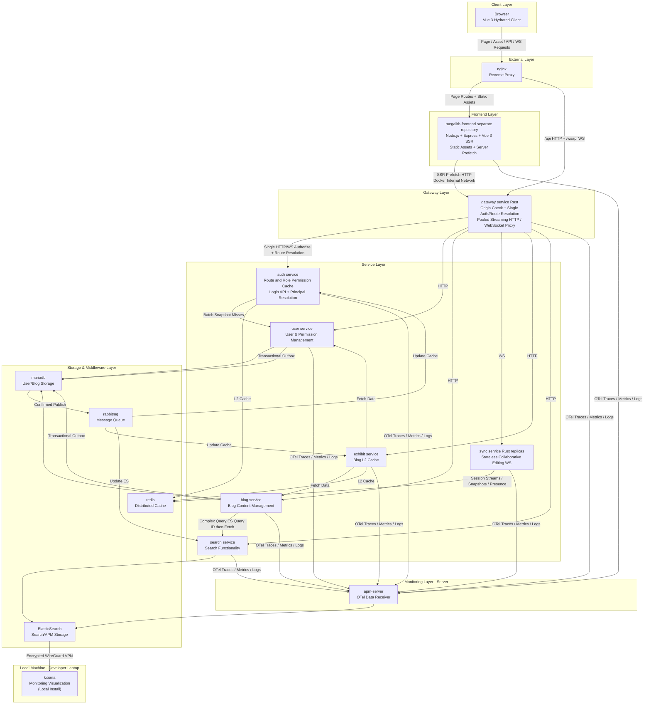

# Megalith Micro

[](https://openjdk.java.net/)
[](https://www.rust-lang.org/)
[](https://nodejs.org/)
[](https://opensource.org/licenses/Apache-2.0)

A Java, Rust, and Node.js microservices platform providing multi-level caching, distributed tracing, server-side rendering, and real-time collaboration capabilities.

## 🏗️ Architecture



## 📦 Modules

### Java Modules (Spring Boot)

| Module | Description |
|--------|-------------|
| `cache` | Megalith Cache Spring Boot Starter - Multi-level caching (L1 Caffeine + L2 Redis) with distributed eviction |
| `auth-api`, `user-api`, `blog-api`, `search-api` | Typed HTTP service contracts and RPC request/response models |
| `common-contract` | Shared result, error, paging, validation, and security contracts |
| `common-rpc` | HTTP client groups, authentication propagation, and external storage/SMS clients |
| `common-web`, `common-auth-web` | Functional WebMVC support, validation, error handling, and authenticated principals |
| `common-observability` | OpenTelemetry propagation, logging, metrics, and runtime hints |
| `common-messaging` | Confirmed delayed consumer retries and dead-letter topology |
| `common-scheduling` | Shared environment-scoped Redis task lock for multi-replica schedulers |
| `common-outbox` | Shared transactional outbox publisher with confirmed delivery and metrics |
| `common-export` | Shared export utilities |
| `micro-auth` | Authentication service - JWT, Email/SMS authentication |
| `micro-blog` | Blog content management with sensitive content handling |
| `micro-user` | User management with Hibernate ORM |
| `micro-exhibit` | Blog display and visit statistics |
| `micro-search` | Full-text search powered by Elasticsearch |

### Rust Modules

| Module | Description |
|--------|-------------|
| `micro-gateway-rs` | High-performance Axum gateway with centralized authorization, dynamic routing, and OpenTelemetry tracing |
| `micro-sync-rs` | Real-time collaboration sync service using WebSocket and YRS CRDT |

### Related Repository

[`megalith-frontend`](https://github.com/mingchiuli/megalith-frontend) is the separately
versioned Vue 3 + Vite SSR application shown in the architecture diagram. Its Node.js runtime
renders public and administration routes, prefetches initial data through this repository's
gateway, and hydrates the application in the browser.

## ✨ Features

- **Multi-Level Caching**: L1 (Caffeine) + L2 (Redis) with automatic eviction via RabbitMQ or Redis pub/sub
- **Bounded Auth Reads**: Protected requests read route/user snapshots and all role snapshots in at most two Redis `MGET` operations; L2 entries expire after 30 minutes
- **Transactional Messaging**: Blog and authorization changes commit their event in the same MariaDB transaction, then publish with RabbitMQ confirms and automatic retry
- **Bounded Password Locking**: Three password failures in a rolling 15-minute window lock the account for 15 minutes; a distributed scheduler restores eligible accounts within 30 seconds
- **Distributed Tracing**: Full OpenTelemetry integration across all services
- **GraalVM Native Support**: All Java microservices support native compilation
- **Real-time Collaboration**: CRDT-based sync via WebSocket (YRS)
- **Stateless Sync Replicas**: Collaboration sessions are relayed and compacted through shared Redis; load balancers do not need sticky sessions
- **Single-Pass Gateway Authorization**: Auth validates the method/path and token, then returns the target service and resolved principal in one synchronous call
- **Trusted Internal Principal**: The gateway replaces any client-supplied identity header and propagates a Base64URL JSON principal containing `userId`, roles, and role-derived data permissions
- **Pooled Streaming Proxy**: The Rust gateway reuses downstream HTTP connections and streams request/response bodies while preserving methods including DELETE and PATCH
- **JWT Edge Authentication**: Access and WebSocket tokens are validated at the gateway/auth boundary instead of being re-evaluated by business handlers
- **JPMS Cache Module**: The reusable cache starter exports only its public API packages

## Gateway Request Flow

1. nginx sends `/api` HTTP requests and `/wsapi` WebSocket upgrades to `micro-gateway-rs`.
2. The gateway validates the request origin when the request carries credentials or uses an unsafe method.
3. The gateway calls `POST /inner/auth/route` once with the original HTTP method, path, client IP, and credential.
4. `micro-auth` decodes a supplied credential, then reads the route snapshot and user-access snapshot in one Redis `MGET`. After route resolution it reads every referenced role-authorization snapshot in one second `MGET`.
5. Cache misses compose user, role, menu, authority, and data-permission repository reads in a
   dedicated query service in `micro-user`; results are written to Caffeine and Redis with a
   30-minute L2 TTL. User and permission mutations emit targeted cache-eviction events, so normal
   revocation is event-driven while TTL bounds stale data if messaging is unavailable.
6. The gateway removes client cookies, access authorization, hop-by-hop headers, and any forged `X-Megalith-Principal`, then injects the trusted principal as unpadded Base64URL JSON. Java services decode it locally and synchronous internal RPCs propagate the same header without another auth call.
7. HTTP requests and responses are streamed through a shared Hyper connection pool. WebSocket upgrades use the same resolved route and principal and do not call auth again.

The normal cache-hit request path is therefore `gateway -> auth -> business`; `micro-user` is only
on the cache-miss path. Public anonymous requests need only the route snapshot. The refresh endpoint forwards only the refresh cookie and validates
it inside auth; ordinary business services never receive browser access or refresh credentials.

Application services own every database, RPC, and cache read, perform validation, and prepare the
complete write input. Wrappers perform only database writes, association replacement, and the
corresponding outbox insert in one short transaction; they never query repositories or delegate
reads back to services. ArchUnit rules enforce both the service transaction boundary and the
wrapper read boundary.

Password failures are counted atomically in a Redis sorted set keyed by user ID. The third failure
inside the rolling 15-minute window conditionally sets `m_user.status` and
`password_locked_until` in one database update. Every `micro-user` replica runs the 30-second
unlock scheduler, while the shared Redis task lock permits only one replica to select expired IDs.
Each selected batch is unlocked with a conditional bulk update that rechecks the locked status and
deadline, then writes the cache-eviction outbox record in the same transaction. Administrator
status changes clear the temporary deadline and therefore override the automatic unlock policy.

## Reliable Messaging

`micro-blog` and `micro-user` share `m_outbox_event`; the `producer` discriminator lets each
service poll only its own rows. Every replica runs the scheduler, but a producer-specific Redis
lock allows only one active publisher for `BLOG` and one for `USER`, so both producers can publish
in parallel. Rows are ordered per aggregate. RabbitMQ confirms and unroutable returns are checked
before success is physically deleted. Failures retry after approximately 1s, 5s, 30s, 2m, then
5m indefinitely with jitter.

Blog events carry a full snapshot and monotonically increasing revision. Elasticsearch uses
`EXTERNAL_GTE` versioning and deletion tombstones; the exhibit cache stores the last applied
revision. Blog updates and deletes use that revision as an optimistic condition; a stale write
returns HTTP 409, and any stale row in a batch delete rolls back the complete batch before an
outbox event is inserted. Consumers retry after 5s, 30s, and 5m, then retain the message in a 14-day DLQ. Outbox
status is exposed at `GET /actuator/outbox`; `POST /actuator/outbox/{eventId}` accepts an `action`
of `pause`, `resume`, `retry`, or `discard`. Successful and discarded rows are physically deleted;
there is no outbox history table.

The blog recycle bin is another consumer of the durable delete event instead of a best-effort
post-commit Redis write. Its Lua operation uses the outbox `eventId` as an idempotency key, appends
the deleted snapshot, and applies the seven-day TTL atomically. Failed deliveries use the shared
retry and DLQ topology, so a committed delete cannot silently disappear from the recycle bin.

The gateway caps concurrent auth calls at 512, applies a 1.2-second deadline to the complete auth
response, and opens a short circuit after repeated infrastructure failures. Both limits are
configurable through `megalith.blog.auth.timeout_ms` and `megalith.blog.auth.max_inflight`.

Only method/path pairs registered in the authority data can be routed. The gateway fails closed
when auth is unavailable. The Docker internal network is the trust boundary for
`X-Megalith-Principal`; internal service ports must not be exposed publicly. Deploy `micro-user`,
`micro-auth`, Java consumers, and `micro-gateway-rs` together in a coordinated maintenance window
when this internal contract changes; external browser and frontend URLs remain unchanged.

## 🛠️ Tech Stack

**Java:**
- Spring Boot 4.1.0
- Hibernate ORM 7.4.5.Final
- Redisson 4.7.0 (Redis)
- Caffeine Cache
- Elasticsearch

**Rust:**
- Axum 0.8 (Web framework)
- Hyper / hyper-util (pooled streaming gateway client)
- Tokio (Async runtime)
- YRS (CRDT)
- OpenTelemetry

**Node.js:**
- Express 5 + Vue 3 SSR
- OpenTelemetry traces, metrics, and logs

**Infrastructure:**
- Nginx (External Gateway + Frontend Proxy)
- MariaDB (User/Blog Storage)
- Redis (Distributed Cache)
- RabbitMQ (Message Queue)
- ElasticSearch (Search + APM Storage)
- APM-Server (OTel Data Receiver)
- Kibana (Monitoring Visualization)

## 🚀 Quick Start

### Prerequisites

- JDK 25
- Rust 2024 edition
- Redis
- RabbitMQ (required for domain events, search indexing, and the default distributed cache eviction path)
- Elasticsearch

### Build

```bash
# Build all Java modules
./gradlew build

# Build Rust modules
cargo build --manifest-path micro-gateway-rs/Cargo.toml
cargo build --manifest-path micro-sync-rs/Cargo.toml
```

### Run

```bash
# Run Java microservices
./gradlew :micro-auth:bootRun
./gradlew :micro-blog:bootRun

# Run Rust services
cargo run --manifest-path micro-gateway-rs/Cargo.toml
cargo run --manifest-path micro-sync-rs/Cargo.toml
```

`micro-sync-rs` requires Redis 6.2 or newer. Every replica must use the same
single-node Redis endpoint through `REDIS_URL`; Redis Cluster is intentionally
not supported. Redis stores the transient collaboration draft for five minutes
after the final connection lease expires. Explicit saves continue to use the
blog service and MariaDB as the source of truth.

Nested sync settings use a double underscore in environment variables, for
example `SYNC__SESSION_RETENTION_SECONDS=300` and `WORKER__CONCURRENCY=4`.

The `cache` starter can use Redis Pub/Sub for cache eviction when Spring AMQP is absent. The
deployed platform still requires RabbitMQ for blog/user domain events and Elasticsearch indexing.

### Breaking Upgrade

This release intentionally has no compatibility bridge and assumes the shared `m_outbox_event`
table, `m_blog.event_revision`, and `m_user.password_locked_until` columns have already been
provisioned, including the `idx_user_password_unlock(status,password_locked_until,id)` index. Deploy `micro-auth`,
`micro-user`, `micro-search`, `micro-exhibit`, `micro-blog`, and `micro-gateway-rs` together, and
start the consumers before reopening traffic so the durable main, retry, and DLQ topology is
present.

## 📁 Project Structure

```
megalith-micro/
├── auth-api/                 # Authentication HTTP contract
├── blog-api/                 # Blog HTTP contract
├── search-api/               # Search HTTP contract
├── user-api/                 # User HTTP contract
├── common-contract/          # Shared wire and error contracts
├── common-rpc/               # HTTP clients and remote adapters
├── common-web/               # Functional WebMVC support
├── common-auth-web/          # Authenticated web support
├── common-observability/     # OpenTelemetry integration
├── common-messaging/         # Consumer retry/DLQ support
├── common-scheduling/        # Distributed scheduler task locks
├── common-outbox/            # Transactional outbox support
├── common-export/            # Export utilities
├── cache/                    # Multi-level cache starter
├── micro-auth/               # Authentication service
├── micro-blog/               # Blog service
├── micro-exhibit/            # Blog display service
├── micro-search/             # Search service
├── micro-user/               # User service
├── micro-gateway-rs/         # Rust API Gateway
└── micro-sync-rs/            # Rust Sync Service
```

## 📄 License

This project is licensed under the Apache License 2.0 - see the [LICENSE](LICENSE) file for details.
