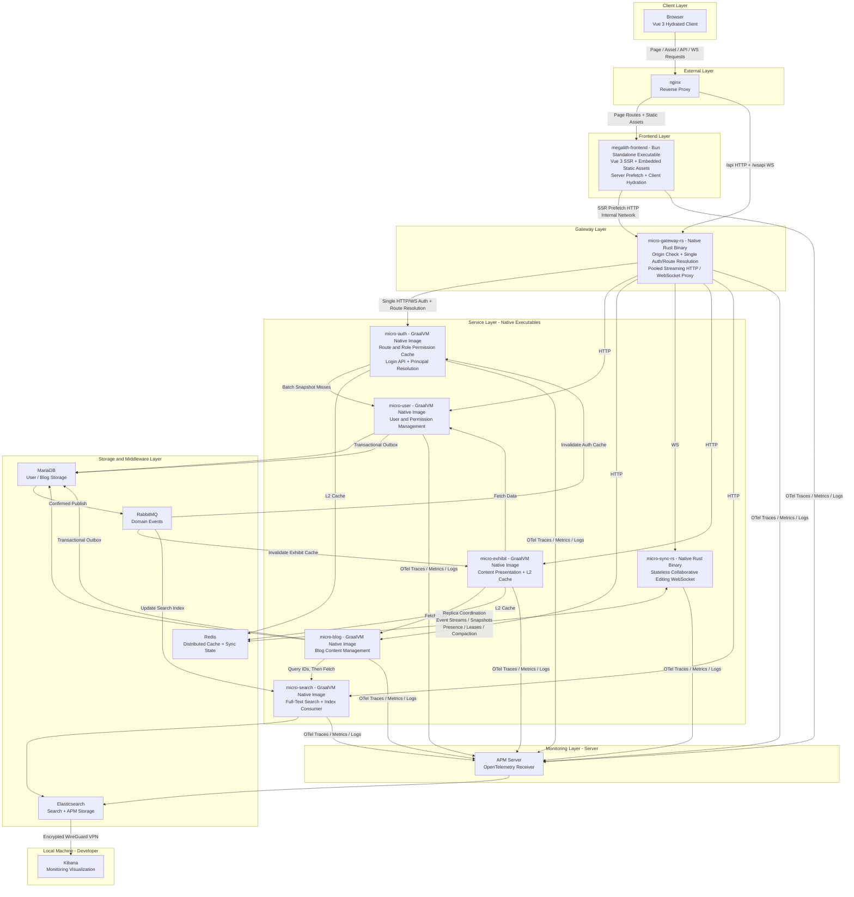

# Megalith Micro

[](https://www.graalvm.org/)
[](https://spring.io/projects/spring-boot)
[](https://www.rust-lang.org/)
[](LICENSE)

Megalith Micro is a microservice backend designed to ship every application as a **single native
executable**.

**The Java services are not deployed as JVM applications or JARs.** All five Spring Boot services
use Java 25 and GraalVM Native Image for ahead-of-time compilation, so their production images do
not require a JVM or JRE. The gateway and collaboration service compile to native Rust binaries;
the frontend service in its separate repository is also compiled to a standalone executable by
Bun.

The entire platform therefore follows the same model: **one application, one native executable,
one independent OCI image**. Application images contain the executable and only the minimal
runtime files, with no source code, build toolchain, or Java runtime.

| Applications | Technology | Production artifact |
| --- | --- | --- |
| `micro-auth`, `micro-user`, `micro-blog`, `micro-exhibit`, `micro-search` | Java 25, Spring Boot, GraalVM | GraalVM Native Image executable |
| `micro-gateway-rs`, `micro-sync-rs` | Rust 2024, Tokio, Axum | Rust release executable |
| [`megalith-frontend`](https://github.com/mingchiuli/megalith-frontend) | Bun, Vue 3 SSR | Bun standalone executable |

> MariaDB, Redis, RabbitMQ, Elasticsearch, and other infrastructure components continue to use
> their standard images. "Single binary" describes how the platform applications are built and
> delivered.

## Architecture



All external traffic enters through nginx. The Rust gateway proxies HTTP and WebSocket requests,
calls `micro-auth` once for authorization and route resolution, and passes a trusted principal to
the target service. Business services never re-parse browser credentials.

`micro-sync-rs` replicas coordinate through Redis. Document and awareness updates are appended to
shared Redis Streams and relayed to connections on every replica, while snapshots, presence
ownership, connection leases, and compaction work remain in shared Redis state. Any replica can
therefore accept a connection for any room without sticky sessions or assigning that room to a
single process.

## Applications and Modules

### Deployable Applications

| Application | Responsibility |
| --- | --- |
| `micro-gateway-rs` | Streaming HTTP/WebSocket proxy, origin checks, centralized authorization entry point, and dynamic routing |
| `micro-auth` | JWT, login, route authorization, and authorization snapshot caches |
| `micro-user` | Users, roles, menus, authorities, and data permissions |
| `micro-blog` | Blog content, recycle bin, and domain events |
| `micro-exhibit` | Content presentation, visit statistics, and presentation caches |
| `micro-search` | Elasticsearch full-text search and index event consumption |
| `micro-sync-rs` | Stateless real-time collaboration backed by YRS CRDT and Redis |

### Shared Java Modules

| Module | Responsibility |
| --- | --- |
| `auth-api`, `user-api`, `blog-api`, `search-api` | Typed HTTP contracts and RPC records |
| `cache` | Caffeine L1 + Redis L2 caching, exact eviction, and replica-wide invalidation |
| `common-contract` | Result, error, paging, validation, and security contracts |
| `common-rpc` | HTTP clients, principal propagation, and external service adapters |
| `common-web`, `common-auth-web` | Functional WebMVC, error handling, validation, and trusted principal resolution |
| `common-observability` | OpenTelemetry integration and GraalVM runtime hints |
| `common-messaging`, `common-outbox` | Consumer retries, dead-letter queues, and the transactional outbox |
| `common-scheduling`, `common-export` | Distributed scheduler locks and export utilities |

## Core Design

- **Single-pass authorization:** the gateway calls `POST /inner/auth/route` once to resolve both
  the target service and trusted principal. Business services trust only the
  `X-Megalith-Principal` injected by the gateway.
- **Two-level caching:** `@Cache` owns cache key generation and reads through Caffeine L1 followed
  by Redis L2. Eviction events are broadcast to every replica to clear local entries.
- **Short write transactions:** services perform reads, validation, and input preparation outside
  a transaction. Wrappers perform only writes and the matching outbox insert inside one short
  transaction. ArchUnit enforces this boundary.
- **Reliable domain events:** user and blog changes commit to a MariaDB transactional outbox before
  confirmed publication through RabbitMQ. Cache eviction and Elasticsearch indexing consume these
  durable events.
- **Stateless collaboration:** `micro-sync-rs` uses YRS CRDT and shared Redis for session streams,
  snapshots, and presence. Replicas do not require sticky sessions.
- **Native observability:** Java Native Image, Rust, and Bun applications export OpenTelemetry
  traces, metrics, and logs.

## Build

### Requirements

- GraalVM for JDK 25 using the HotSpot JVM, not the Espresso JVM
- Gradle 9.7 through the included Wrapper
- Rust stable with 2024 edition support
- Docker for OCI image builds

Example on macOS:

```bash
export JAVA_HOME=/Library/Java/JavaVirtualMachines/graalvm-25.2.4+7.1/Contents/Home
```

### Checks and Tests

```bash
./gradlew build
cargo fmt --all -- --check
cargo clippy --workspace --all-targets -- -D warnings
cargo test --workspace
```

The Java build includes Spotless, unit tests, ArchUnit, and Spring AOT test processing.

### Native Executables

```bash
# Java / GraalVM Native Image
./gradlew :micro-auth:nativeCompile

# Rust
cargo build --workspace --release
```

Java artifacts are written to each module's `build/native/nativeCompile/` directory. Rust artifacts
are written to `target/release/`.

### Application Images

Spring Boot Buildpacks compile and publish each Java service as a GraalVM Native Image. Set
`DOCKER_USERNAME` and `DOCKER_PWD` before running the task:

```bash
./gradlew :micro-auth:bootBuildImage
```

The Rust services use multi-stage Dockerfiles. Their final images copy only the release executable
and required runtime files:

```bash
docker build -t megalith-micro-gateway-rs:latest -f micro-gateway-rs/Dockerfile .
docker build -t megalith-micro-sync-rs:latest -f micro-sync-rs/Dockerfile .
```

CI validates AOT processing and builds a separate GraalVM Native Image for each of the five Java
services. It formats, lints, and tests the two Rust services before building their release images.
Every service is published and deployed independently.

### Development

Native compilation can be skipped when running a single service during development:

```bash
./gradlew :micro-auth:bootRun
cargo run -p micro-gateway-rs
```

A complete local deployment also requires MariaDB, Redis, RabbitMQ, and Elasticsearch. Connection,
port, and OpenTelemetry settings are defined in each module's `application.yml`.

## License

This project is licensed under the [Apache License 2.0](LICENSE).
